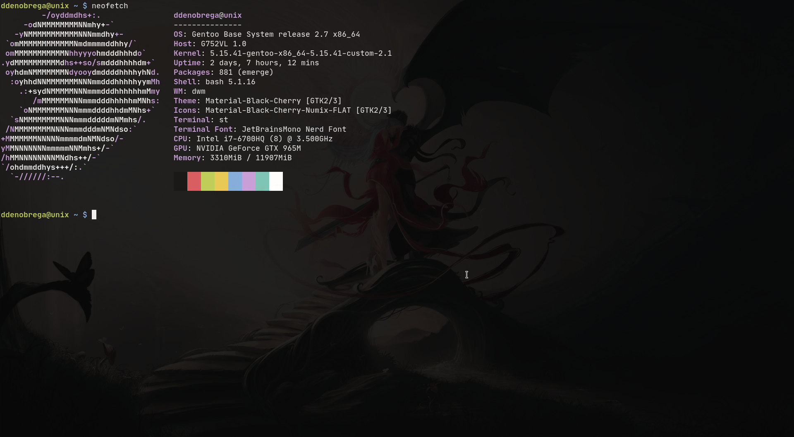

# ST
## Description
This Repository is a fork of [ST - Suckless Terminal](https://st.suckless.org).

## Screenshots

## Changes
### Patches
- [ScrollBack](https://st.suckless.org/patches/scrollback/st-scrollback-20210507-4536f46.diff)
### Code Modification
- Added [Moonfly](https://github.com/bluz71/vim-moonfly-colors) Inspired Colorscheme

## Installing
- Clone this Repository
	- `git clone https://github.com/ddenobrega/st`
- Change working directory to that of this Repository
	- `cd st`
- Compile and Install ST
	- `sudo make clean install`

### Dependencies
- JetBrainsMono Nerd Font
- Xft
- Glibc

## Credits
- [Suckless Community](https://suckless.org)
- [ScrollBack Patch Developers](https://st.suckless.org/patches/scrollback/)
- [My Website](https://ddenobrega.github.io)
- [My Github](https://github.com/ddenobrega)
- Email: dcdenobrega@gmail.com

